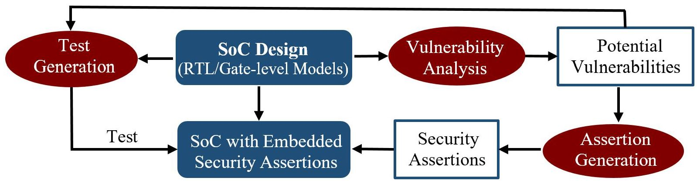

# ISV (Integrated Security Validation in RTL Models)

ISV is an executable of security valiadtion framework for RTL Models using security assertions. ISV execute a vulnerability detection and genetare security assertions for a given RTL. Then the security assertions are converted to branch conditions and activated through concolic testing. ISV is developed at [Embedded Systems Lab, Department of Computer Science, University of Florida](https://www.cise.ufl.edu/research/cad), as a deliverable for a [SRC](https://www.src.org/) project. For more details, please refer to [ACMTODAES Paper](https://dl.acm.org/doi/abs/10.1145/3441297).

### Overview



## Citing ISV
```
@article{witharana2021directed,
  title={Directed test generation for activation of security assertions in rtl models},
  author={Witharana, Hasini and Lyu, Yangdi and Mishra, Prabhat},
  journal={ACM Transactions on Design Automation of Electronic Systems (TODAES)},
  volume={26},
  number={4},
  pages={1--28},
  year={2021},
  publisher={ACM New York, NY, USA}
}
```

## Setup
We provide a [docker file](Dockerfile), which we recommend to start with. To set ISV up locally, one can follow the instructions in the [docker file](Dockerfile). To build and run:
```
$ docker build -t isv .
$ docker run -it isv
```
## Usage
1. Naviagte to the Benchmark
```
$ cd Benchmarks/arbiter
```
2. Provide design specific data in [parameter file](Benchmarks/arbiter/Makefile.inc)
```
TOP_MODULE 	= arb
CLK_NAME 	= clk
RESET_NAME 	= rst
RESET_EDGE 	= 1
UNROLL_CYC	= 10
```
3. Run ISV
```
$ isv -d arbiter.v -r 0.5 -i 10
```

4. ISV Parameters
```
  -h, --help            
  -d DESIGN_FILE     <Design file path>
  -r THREASHOLD      <Threshold value>               <default 0.1>
  -n NO_COMBINATION  <Combination value>             <default 1>
  -i ITERATION       <Iterations per simulation>     <default 1000>
  -c UNROLL_CYCLE    <Cycles per simulation>         <default 10>
  -t TOOL            <Tool used for the simulation>  <default iverilog>
```

## Authors
* [Hasini Witharana](https://www.cise.ufl.edu/~hdilanka/)
* Yangdi Lyu
* [Prabhat Mishra](https://www.cise.ufl.edu/~prabhat/)

## License
The IVS code uses [Apache License 2.0](ivs/LICENSE).